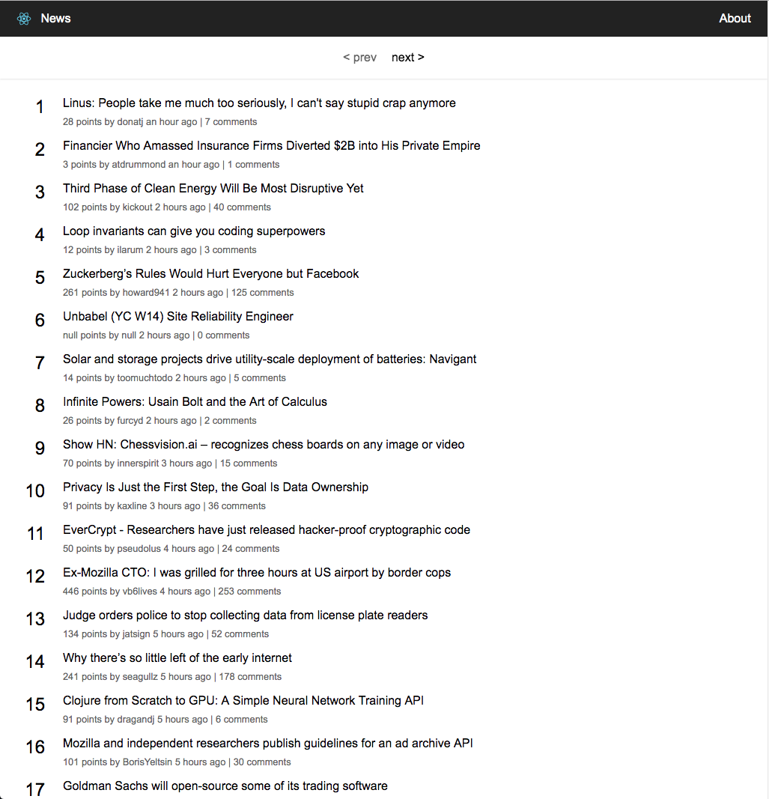

# Test Description

Create a news app using `React` and a fake hacker-news api. The api server is a node server and can be run locally. Please make sure you have `node >=10.x` installed before the test and also make sure you have internet access. The news app will be showing a list of news with pagination. Please put all your code inside of `src` folder and do not change anything outside of it. You are allowed to install any dependencies you want. If you find any issues or uncertainty during the test, please feel free to go ahead with your decision and explain why you made this decision.

Estimated time to complete: **2.5 hours**

**Screenshot**:



**Requirements**:

- use `React`
- use `ES6`
- header and pagination bar should be fixed on the top
- use the theme inside of `src/style/theme.js`
- the list on every page must be sorted by `time` in descending order, if `time` are the equal, then sort by `comments_count` in descending order
- `prev` button of the pagination should be disabled when the current page is 1

**Nice to have**:

- use `Redux` for state management, it's overkill for this test but would be nice if you can show your understanding of `Redux`
- use `styled-components` or any other css-in-js implementations
- some error handling either shown on the page or logged to browser console

**Do not need**

- localization
- do not need to worry about the total number of pages

## Getting Started

### Dev Server

```
npm start
```

this will start the dev server and bundle your code, and then show on `localhost:3000`, you can change the port in `.env` in the root folder

### Loading Svg

You can import svgs as react components directly.

```js
import { ReactComponent as Logo } from './logo.svg';
const App = () => (
  <div>
    {/* Logo is an actual React component */}
    <Logo />
  </div>
);
```

### API Server

```
npm run server
```

this will start the api server on port `1337`. You can change the port in `server/.env`.

To access the api, go to `localhost:1337` with the following url:

- `GET /news?page=1`
  Returns 30 news items each page.

## Formatting

The project has prettier configured, so you can use `prettier` in your editor if you want.
